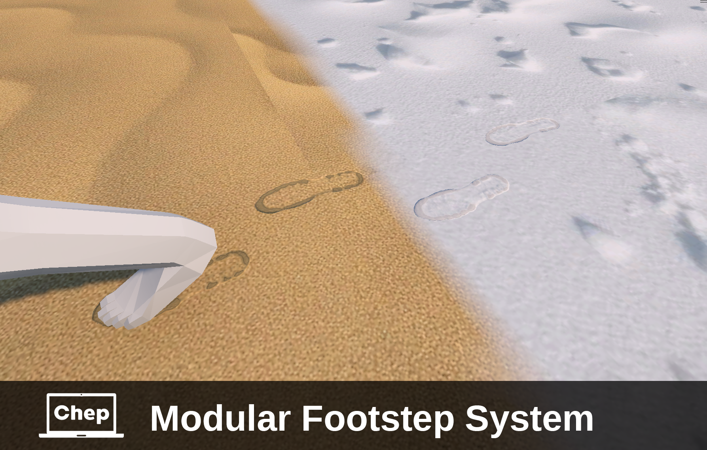

# Modular Footstep System

**Available on Asset Store:** *Later*

This plugin is designed to add footstep effects (such as sounds, traces, and particles) to game entities.

## Key Features of the Plugin:

#### 1. Types of Effects:
- Footstep traces (decals).
- Footstep sounds.
- Particle effects.

#### 2. Modularity:
- Combine different effects or use them individually.

#### 3. Adaptation to Surfaces:
- Different effects can play depending on the surface type (e.g., sand, wood, stone).

#### 4. Entity States:
- Effects can change based on the entity's state (e.g., walking steps differ from running steps).

#### 5. Flexible Configuration:
- Effects can be configured through a user-friendly interface or by manually adding components for advanced customization.

#### Why is it Useful?
The plugin simplifies the process of creating footstep effects in games, enhancing realism and immersion. It is especially useful for game developers working on projects with diverse environments and character animations where detailed effects improve player engagement.

#### Compatibility:
The system is compatible with Unity 2023 and Unity 6.

**Render pipelines:**
- Built-in ✔️
- URP ✔️
- HDRP ✔️

#### NOTE:
This is a scripting/tool only and doesn't contain any audio clips or particle effects.

## INSTALLATION
There are 3 ways to install this plugin:

- import [MFS.unitypackage](https://github.com/dimdimich123/UnityDecalFootsteps/releases) via *Assets-Import Package*
- clone/download this repository and move the **ModularFootstepSystem** folder to your Unity project's **Assets** folder
- import it from Asset Store (Later)

## User Guide:
You can find the user guide in the repository under the path [Assets\ModularFootstepSystem\ModularFootstepSystemManual.pdf](Assets/ModularFootstepSystem/ModularFootstepSystemManual.pdf) or in the Unity package files under *ModularFootstepSystem\ModularFootstepSystemManual*.

